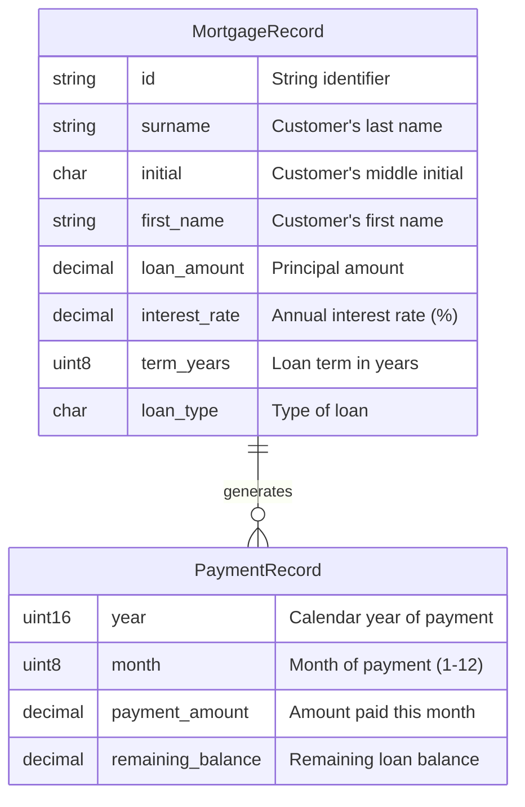
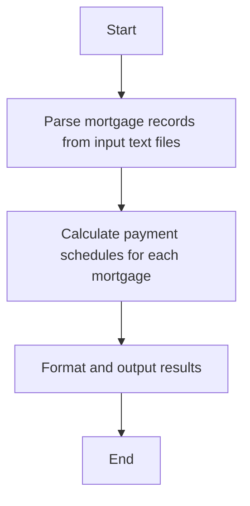
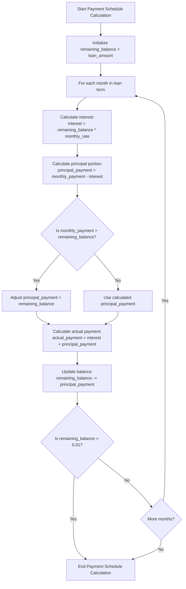

# Mortgage Calculator

## Overview

This document explains the Rust implementation of a mortgage calculator that processes mortgage records and generates payment schedules. The implementation uses the rust_decimal crate to ensure high precision financial calculations without floating-point rounding errors.

## Data Structures



## Processing Flow



## Decimal Precision

The implementation uses rust_decimal crate which provides a fixed-point decimal number implementation with the following characteristics:

* 96 bits of significant digits (28-29 decimal digits)
* Scale ranging from 0 to 28 (defined by rust_decimal::Decimal)
* No floating-point rounding errors that are common with IEEE 754 floating-point types
* Exact decimal representation ideal for financial calculations

## Mortgage Calculation Algorithm

### Monthly Payment Formula
The monthly payment amount is calculated using the standard mortgage formula:

$$P = L\frac{r(1 + r)^n}{(1 + r)^n - 1}$$

Where:

$P$ = monthly payment amount

$L$ = loan amount

$r$ = monthly interest rate (annual rate ÷ 12 ÷ 100)

$n$ = total number of payments (term in years × 12)

## Implementation Details

### 1. Convert Annual Interest Rate to Monthly Rate:

```rust
let monthly_rate = record.interest_rate / dec!(100) / dec!(12);
```

This divides the annual percentage rate by 100 to convert to decimal form, then divides by 12 for the monthly rate. Using Decimal ensures precise division without floating-point errors.

### 2. Calculate the Payment Amount:
```rust
let base = dec!(1) + monthly_rate;
let power_term = base.powi(num_payments as i64);

let numerator = monthly_rate * power_term;
let denominator = power_term - dec!(1);

let monthly_payment = record.loan_amount * numerator / denominator;
```

This implements the formula $(1+r)^n$ using the powi method from the MathematicalOps trait. All operations are performed using Decimal to maintain precision.

### 3. Edge Cases Handling: 

The code handles special cases such as:

* Zero interest rate loans (equal principal payments)
* Zero loan amount (results in no payments)
* Potential division by zero

### 4. Payment Schedule Calculation:



## Precision Considerations

Each calculation step uses `rust_decimal::Decimal which:

1. **Stores Exact Decimal Values:** Unlike floating-point types that use binary fractions (leading to errors representing values like 0.1), Decimal stores exact decimal values.
2. **Mathematical Operations:**
   * **Addition/subtraction:** Exact with no precision loss
   * **Multiplication:** Preserves scale according to decimal multiplication rules
   * **Division:** Implements controlled rounding behavior
   * **Exponentiation:** Through powi method, maintains precision for integer powers
3. **Potential Precision Limitations:**
   * **When calculating** $(1+r)^n$ for large values of n, there could be accumulated rounding
   * **For extremely small interest rates**, there might be precision concerns in the calculation of the denominator 
4. **Zero Balance Handling:** The code ensures that tiny negative balances due to rounding are handled appropriately:
```rust
if remaining_balance < dec!(0.01) {
    break;
}
```

## Input Parsing and Validation

The implementation carefully parses fixed-width text records, handling potential errors:

* Line length validation
* Numerical field parsing with detailed error reporting
* Trimming of whitespace from text fields

## Testing Strategy

The code includes comprehensive tests for:

* Record parsing with valid and invalid input
* Payment calculation with standard mortgage parameters
* Edge cases: zero interest, zero loan amount
* End-to-end processing verification

## Performance and Memory Considerations

* **rust_decimal** operations are slower than native floating-point operations but offer essential precision
* **Memory usage** is higher than using primitive float types (96 bits per Decimal vs 32/64 for float/double)
* The implementation builds complete payment schedules in memory, which scales linearly with the loan term

## Conclusion
The implementation provides an accurate, robust mortgage calculator that avoids floating-point precision issues by using the rust_decimal crate. This approach ensures that financial calculations are performed with appropriate precision for monetary values.